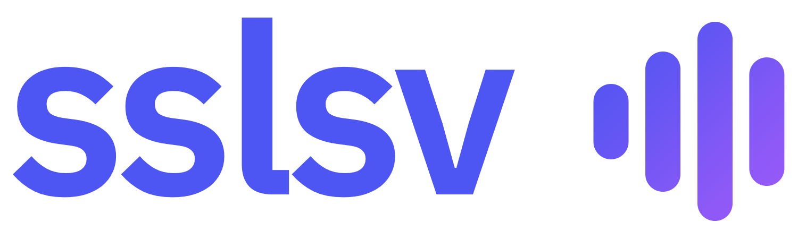

<p align="center">
  
</p>

<p align="center">
  
  
  
</p>

# sslsv

**sslsv** is a PyTorch-based Deep Learning framework consisting of a collection of **Self-Supervised Learning** (SSL) methods for learning speaker representations applicable to different speaker-related downstream tasks, notably **Speaker Verification** (SV).

Our aim is to: **(1) provide self-supervised SOTA methods** by porting algorithms from the computer vision domain; and **(2) evaluate them in a comparable environment**.

Our training framework is depicted by the figure below.

<p align="center">
  
</p>

---

## News

* **April 2024** – :clap: Introduction of new various methods and complete refactoring (v2.0).
* **June 2022** – :stars: First release of sslsv (v1.0).

---

## Features

**General**

- **Data**:
  - Supervised and Self-supervised datasets (siamese and DINO sampling)
  - Audio augmentation (noise and reverberation)
- **Training**:
  - CPU, GPU and multi-GPUs (*DataParallel* and *DistributedDataParallel*)
  - Checkpointing, resuming, early stopping and logging
  - Tensorboard and wandb
- **Evaluation**:
  - Speaker verification
    - Backend: Cosine scoring and PLDA
    - Metrics: EER, MinDCF, ActDFC, CLLR, AvgRPrec
  - Classification (emotion, language, ...)
- **Notebooks**: DET curve, scores distribution, t-SNE on embeddings, ...
- **Misc**: scalable config, typing, documentation and tests

<details>
  <summary><b>Encoders</b></summary>

- **TDNN** (`sslsv.encoders.TDNN`)  
  X-vectors: Robust dnn embeddings for speaker recognition ([PDF](https://www.danielpovey.com/files/2018_icassp_xvectors.pdf))  
  *David Snyder, Daniel Garcia-Romero, Gregory Sell, Daniel Povey, Sanjeev Khudanpur*

- **Simple Audio CNN** (`sslsv.encoders.SimpleAudioCNN`)  
  Representation Learning with Contrastive Predictive Coding ([arXiv](https://arxiv.org/abs/1807.03748))  
  *Aaron van den Oord, Yazhe Li, Oriol Vinyals*

- **ResNet-34** (`sslsv.encoders.ResNet34`)  
  VoxCeleb2: Deep Speaker Recognition ([arXiv](https://arxiv.org/abs/1806.05622))  
  *Joon Son Chung, Arsha Nagrani, Andrew Zisserman*

- **ECAPA-TDNN** (`sslsv.encoders.ECAPATDNN`)  
  ECAPA-TDNN: Emphasized Channel Attention, Propagation and Aggregation in TDNN Based Speaker Verification ([arXiv](https://arxiv.org/abs/2005.07143))  
  *Brecht Desplanques, Jenthe Thienpondt, Kris Demuynck*
</details>

<details>
  <summary><b>Methods</b></summary>

- **LIM** (`sslsv.methods.LIM`)  
  Learning Speaker Representations with Mutual Information ([arXiv](https://arxiv.org/abs/1812.00271))  
  *Mirco Ravanelli, Yoshua Bengio*

- **CPC** (`sslsv.methods.CPC`)  
  Representation Learning with Contrastive Predictive Coding ([arXiv](https://arxiv.org/abs/1807.03748))  
  *Aaron van den Oord, Yazhe Li, Oriol Vinyals*

- **SimCLR** (`sslsv.methods.SimCLR`)  
  A Simple Framework for Contrastive Learning of Visual Representations ([arXiv](https://arxiv.org/abs/2002.05709))  
  *Ting Chen, Simon Kornblith, Mohammad Norouzi, Geoffrey Hinton*

- **MoCo v2+** (`sslsv.methods.MoCo`)  
  Improved Baselines with Momentum Contrastive Learning ([arXiv](https://arxiv.org/abs/2003.04297))  
  *Xinlei Chen, Haoqi Fan, Ross Girshick, Kaiming He*

- **DeepCluster v2** (`sslsv.methods.DeepCluster`)  
  Deep Clustering for Unsupervised Learning of Visual Features ([arXiv](https://arxiv.org/abs/1807.05520))  
  *Mathilde Caron, Piotr Bojanowski, Armand Joulin, Matthijs Douze*

- **SwAV** (`sslsv.methods.SwAV`)  
  Unsupervised Learning of Visual Features by Contrasting Cluster Assignments ([arXiv](https://arxiv.org/abs/2006.09882))  
  *Mathilde Caron, Ishan Misra, Julien Mairal, Priya Goyal, Piotr Bojanowski, Armand Joulin*

- **W-MSE** (`sslsv.methods.WMSE`)  
  Whitening for Self-Supervised Representation Learning ([arXiv](https://arxiv.org/abs/2007.06346))  
  *Aleksandr Ermolov, Aliaksandr Siarohin, Enver Sangineto, Nicu Sebe*

- **Barlow Twins** (`sslsv.methods.BarlowTwins`)  
  Barlow Twins: Self-Supervised Learning via Redundancy Reduction ([arXiv](https://arxiv.org/abs/2103.03230))  
  *Jure Zbontar, Li Jing, Ishan Misra, Yann LeCun, Stéphane Deny*

- **VICReg** (`sslsv.methods.VICReg`)  
  VICReg: Variance-Invariance-Covariance Regularization for Self-Supervised Learning ([arXiv](https://arxiv.org/abs/2105.04906))  
  *Adrien Bardes, Jean Ponce, Yann LeCun*

- **VIbCReg** (`sslsv.methods.VIbCReg`)  
  Computer Vision Self-supervised Learning Methods on Time Series ([arXiv](https://arxiv.org/abs/2109.00783))  
  *Daesoo Lee, Erlend Aune*

- **BYOL** (`sslsv.methods.BYOL`)  
  Bootstrap Your Own Latent: A New Approach to Self-Supervised Learning ([arXiv](https://arxiv.org/abs/2006.07733))  
  *Jean-Bastien Grill, Florian Strub, Florent Altché, Corentin Tallec, Pierre H. Richemond, Elena Buchatskaya, Carl Doersch, Bernardo Avila Pires, Zhaohan Daniel Guo, Mohammad Gheshlaghi Azar, Bilal Piot, Koray Kavukcuoglu, Rémi Munos, Michal Valko*

- **SimSiam** (`sslsv.methods.SimSiam`)  
  Exploring Simple Siamese Representation Learning ([arXiv](https://arxiv.org/abs/2011.10566))  
  *Xinlei Chen, Kaiming He*

- **DINO** (`sslsv.methods.DINO`)  
  Emerging Properties in Self-Supervised Vision Transformers ([arXiv](https://arxiv.org/abs/2104.14294))  
  *Mathilde Caron, Hugo Touvron, Ishan Misra, Hervé Jégou, Julien Mairal, Piotr Bojanowski, Armand Joulin*
</details>

<details open>
  <summary><b>Methods (ours)</b></summary>

- **Combiner** (`sslsv.methods.Combiner`)  
  Label-Efficient Self-Supervised Speaker Verification With Information Maximization and Contrastive Learning ([arXiv](https://arxiv.org/abs/2207.05506))  
  *Theo Lepage, Reda Dehak*

- **SimCLR Margins** (`sslsv.methods.SimCLRMargins`)  
  Additive Margin in Contrastive Self-Supervised Frameworks to Learn Discriminative Speaker Representations ([arXiv](https://arxiv.org/abs/2404.14913))  
  *Theo Lepage, Reda Dehak*

- **MoCo Margins** (`sslsv.methods.MoCoMargins`)  
  Additive Margin in Contrastive Self-Supervised Frameworks to Learn Discriminative Speaker Representations ([arXiv](https://arxiv.org/abs/2404.14913))  
  *Theo Lepage, Reda Dehak*

- **SSPS** (`sslsv.methods._SSPS`)  
  Self-Supervised Frameworks for Speaker Verification via Bootstrapped Positive Sampling
 ([arxiv](https://arxiv.org/abs/2501.17772))  
 *Theo Lepage, Reda Dehak*

</details>


---

## Requirements

*sslsv* runs on Python 3.13.3 with the following dependencies.

| Module                | Versions |
|-----------------------|:--------:|
| torch                 | 2.7.1    |
| torchaudio            | 2.7.1    |
| numpy                 | *        |
| pandas                | *        |
| soundfile             | *        |
| scikit-learn          | *        |
| speechbrain           | *        |
| tensorboard           | *        |
| wandb                 | *        |
| ruamel.yaml           | *        |
| dacite                | *        |
| prettyprinter         | *        |
| tqdm                  | *        |

**Note**: developers will also need `pytest`, `pre-commit` and `twine` to work on this project.

---

## Datasets

**Speaker recognition**:
- [VoxCeleb1](https://www.robots.ox.ac.uk/~vgg/data/voxceleb/vox1.html) (train and test)
- [VoxCeleb2](https://www.robots.ox.ac.uk/~vgg/data/voxceleb/vox2.html) (train)
- [SITW](http://www.speech.sri.com/projects/sitw/) (test)
- [VOiCES](https://iqtlabs.github.io/voices/) (test)

**Language recognition**:
- [VoxLingua107](https://bark.phon.ioc.ee/voxlingua107/)

**Emotion recognition**:
- [CREMA-D](https://github.com/CheyneyComputerScience/CREMA-D)

**Data-augmentation**:
- [MUSAN](http://www.openslr.org/17/)
- [Room Impulse Response and Noise Database](https://www.openslr.org/28/)

Data used for main experiments (conducted on VoxCeleb1 and VoxCeleb2 + data-augmentation) can be automatically downloaded, extracted and prepared using the following scripts.

```bash
python tools/prepare_data/prepare_voxceleb.py data/
python tools/prepare_data/prepare_augmentation.py data/
```

The resulting `data` folder shoud have the structure presented below.

```
data
├── musan_split/
├── simulated_rirs/
├── voxceleb1/
├── voxceleb2/
├── voxceleb1_test_O
├── voxceleb1_test_H
├── voxceleb1_test_E
├── voxsrc2021_val
├── voxceleb1_train.csv
└── voxceleb2_train.csv
```

Other datasets have to be manually downloaded and extracted but their train and trials files can be created using the corresponding scripts from the `tools/prepare_data/` folder.

- Example format of a train file (`voxceleb1_train.csv`)
  ```
  File,Speaker
  voxceleb1/id10001/1zcIwhmdeo4/00001.wav,id10001
  ...
  voxceleb1/id11251/s4R4hvqrhFw/00009.wav,id11251
  ```

- Example format of a trials file (`voxceleb1_test_O`)
  ```
  1 voxceleb1/id10270/x6uYqmx31kE/00001.wav voxceleb1/id10270/8jEAjG6SegY/00008.wav
  ...
  0 voxceleb1/id10309/0cYFdtyWVds/00005.wav voxceleb1/id10296/Y-qKARMSO7k/00001.wav
  ```

<!-- *Please refer to the associated code if you want further details about data preparation.* -->

---

## Installation

1. **Clone this repository**: `git clone https://github.com/theolepage/sslsv.git`.
2. **Install dependencies**: `pip install -r requirements.txt`.

**Note**: *sslsv* can also be installed as a standalone package via pip with `pip install sslsv` or with `pip install .` (in the project root folder) to get the latest version.

---

## Usage


- **Start a training** (*2 GPUs*): `./train_ddp.sh 2 <config_path>`.
- **Evaluate your model** (*2 GPUs*): `./evaluate_ddp.sh 2 <config_path>`.

**Note**: use `sslsv/bin/train.py` and `sslsv/bin/evaluate.py` for non-distributed mode to run with a CPU, a single GPU or multiple GPUs (*DataParallel*).


### Tensorboard

You can visualize your experiments with `tensorboard --logdir models/your_model/`.

### wandb

Use `wandb online` and `wandb offline` to toggle wandb. To log your experiments you first need to provide your API key with `wandb login API_KEY`.

---

## Documentation

*Documentation is currently being developed...*

---

## Results

### SSL frameworks

- **Configs**: `models/ssl/voxceleb2/`
- **Train set**: VoxCeleb2
- **Evaluation**: VoxCeleb1-O (Original)
- **Encoder**: Fast ResNet-34 and ECAPA-TDNN

#### Fast ResNet-34

| Method           | Model                                                                         | EER (%) | minDCF (p=0.01) | Checkpoint                                                                                     |
|------------------|-------------------------------------------------------------------------------|:-------:|:---------------:|:----------------------------------------------------------------------------------------------:|
| **LIM**          | `lim/lim_loss-NCE_proj-2048-BN-R-2048-BN-R-512`                               | 16.13   | 0.9015          |                                                                                                |
| **CPC**          | `cpc/cpc_t-4_agg-GRU-1-256`                                                   | 12.77   | 0.8033          |                                                                                                |
| **SimCLR**       | `simclr/simclr_proj-none_t-0.03`                                              |  9.05   | 0.6364          | [:link:](https://drive.google.com/drive/folders/14mAactPvU819-YHsuZHxpA_QAMu3IT88?usp=sharing) |
| **MoCo**         | `moco/moco_proj-none_Q-32768_t-0.03_m-0.999`                                  |  8.49   | 0.5990          | [:link:](https://drive.google.com/drive/folders/1F1HZEzeVta1n6-MOT-0F27LAupwvxqyM?usp=sharing) |
| **DeepCluster**  | `deepcluster/deepcluster_proj-2048-BN-R-2048-BN-R-512_K-3000-3000-3000_t-0.1` | 15.16   | 0.8193          |                                                                                                |
| **SwAV**         | `swav/swav_proj-2048-BN-R-2048-BN-R-512_K-6000_t-0.1`                         | 11.82   | 0.7177          | [:link:](https://drive.google.com/drive/folders/1VC1jVhWK22mfk_B3ZwFV5mxMueNIcvqb?usp=sharing) |
| **W-MSE**        | `wmse/wmse_proj-1024-BN-R-64_ws-128`                                          | 14.62   | 0.8506          |                                                                                                |
| **Barlow Twins** | `barlowtwins/barlowtwins_proj-2048-BN-R-2048-BN-R-512_lambda-0.005`           | 13.22   | 0.7658          |                                                                                                |
| **VICReg**       | `vicreg/vicreg_proj-2048-BN-R-2048-BN-R-512_inv-1.0_var-1.0_cov-0.1`          | 11.33   | 0.6658          | [:link:](https://drive.google.com/drive/folders/1AvOWDX4m9mdzI8QSpcrir1kSui0rm8I0?usp=sharing) |
| **BYOL**         | `byol/byol_proj-2048-BN-R-2048-BN-R-512_pred-4096-BN-R-256_m-0.996-sched`     | 13.99   | 0.7509          |                                                                                                |
| **SimSiam**      | `simsiam/simsiam_proj-2048-BN-R-2048-BN-R-512-BN_pred-512-BN-R-2048`          | 28.94   | 0.9984          |                                                                                                |
| **DINO**         | `dino/dino_proj-2048-BN-G-2048-BN-G-256-L2-65536_G-2x4_L-4x2_t-0.04`          |  6.04   | 0.4526          | [:link:](https://drive.google.com/drive/folders/1DAvRYNlZFR7zllymsCfS2Yoa3Wt1tv0Z?usp=sharing) |
| **Supervised**   | `supervised/supervised_loss-AAM_s-30_m-0.2`                                   |  2.95   | 0.3122          | [:link:](https://drive.google.com/drive/folders/1CZpeaiK6bCcOsvgdEeVj6n-XqKoiJkJs?usp=sharing) |

#### ECAPA-TDNN

| Method         | Model                                                                                   | EER (%) | minDCF (p=0.01) | Checkpoint                                                                                     |
|----------------|-----------------------------------------------------------------------------------------|:-------:|:---------------:|:----------------------------------------------------------------------------------------------:|
| **SimCLR**     | `simclr/simclr_enc-ECAPATDNN-1024_proj-none_t-0.03`                                     | 6.41    | 0.5160          | [:link:](https://drive.google.com/drive/folders/1ziVtNDFspiC1Qbj8kbqb5s9e1LW98Vmt?usp=sharing) |
| **MoCo**       | `moco/moco_enc-ECAPATDNN-1024_proj-none_Q-32768_t-0.03_m-0.999`                         | 6.48    | 0.5372          | [:link:](https://drive.google.com/drive/folders/1obndtNWHm8I4-9rhxugS7OFlUbFhCNGh?usp=sharing) |
| **SwAV**       | `swav/swav_enc-ECAPATDNN-1024_proj-2048-BN-R-2048-BN-R-512_K-6000_t-0.1`                | 8.12    | 0.6148          | [:link:](https://drive.google.com/drive/folders/1_oDDza2fau84tZA060Wy8xZfy_guAy6w?usp=sharing) |
| **VICReg**     | `vicreg/vicreg_enc-ECAPATDNN-1024_proj-2048-BN-R-2048-BN-R-512_inv-1.0_var-1.0_cov-0.1` | 7.42    | 0.5659          | [:link:](https://drive.google.com/drive/folders/1Ir37Nh6O38biOvHeW6pzgcMB8oOaAdEg?usp=sharing) |
| **DINO**       | `dino/dino_enc-ECAPATDNN-1024_proj-2048-BN-G-2048-BN-G-256-L2-65536_G-2x4_L-4x2_t-0.04` | 2.82    | 0.3463          | [:link:](https://drive.google.com/drive/folders/1_4jkqiumnFjHfMcYrm8ckpRo85c4Gdqd?usp=sharing) |
| **Supervised** | `supervised/supervised_enc-ECAPATDNN-1024_loss-AAM_s-30_m-0.2`                          | 1.34    | 0.1521          | [:link:](https://drive.google.com/drive/folders/1ZTXgZeWv9dbnosLzMtHU4wSQXvg9M-SF?usp=sharing) |

### SSPS

- **Configs**: `models/ssps/voxceleb2/`
- **Train set**: VoxCeleb2
- **Evaluation**: VoxCeleb1-O (Original)
- **Encoder**: ECAPA-TDNN

| Method         | Model                                                                              | EER (%) | minDCF (p=0.01) | Checkpoint                                                                                     |
|----------------|------------------------------------------------------------------------------------|:-------:|:---------------:|:----------------------------------------------------------------------------------------------:|
| **SimCLR**     | `simclr_e-ecapa/ssps_kmeans_25k_uni-1`                                             | 2.57    | 0.3033          | [:link:](https://drive.google.com/drive/folders/1Uv09fswUNDCbhrxR8_e8kOLVa60KB2rW?usp=sharing) |
| **DINO**       | `dino_e-ecapa/ssps_kmeans_25k_uni-1`                                               | 2.53    | 0.2843          | [:link:](https://drive.google.com/drive/folders/1wgtHkaha6O0lIT0hN3Hcf8bGIk9wHBA1?usp=sharing) |

---

## Acknowledgements

*sslsv* contains third-party components and code adapted from other open-source projects, including: [voxceleb_trainer](https://github.com/clovaai/voxceleb_trainer), [voxceleb_unsupervised](https://github.com/joonson/voxceleb_unsupervised) and [solo-learn](https://github.com/vturrisi/solo-learn).

---

## Citations

If you use *sslsv*, please consider starring this repository on GitHub and citing one the following papers.

```BibTeX
@InProceedings{lepage2025SSPS,
  title     = {SSPS: Self-Supervised Positive Sampling for Robust Self-Supervised Speaker Verification},
  author    = {Lepage, Theo and Dehak, Reda},
  year      = {2025},
  booktitle = {Interspeech 2025},
  url       = {https://arxiv.org/abs/2505.14561},
}

@Article{lepage2025SSLSVBootstrappedPositiveSampling,
  title     = {Self-Supervised Frameworks for Speaker Verification via Bootstrapped Positive Sampling},
  author    = {Lepage, Theo and Dehak, Reda},
  year      = {2025},
  journal   = {arXiv preprint library},
  url       = {https://arxiv.org/abs/2501.17772},
}

@InProceedings{lepage2024AdditiveMarginSSLSV,
  title     = {Additive Margin in Contrastive Self-Supervised Frameworks to Learn Discriminative Speaker Representations},
  author    = {Lepage, Theo and Dehak, Reda},
  year      = {2024},
  booktitle = {The Speaker and Language Recognition Workshop (Odyssey 2024)},
  pages     = {38--42},
  doi       = {10.21437/odyssey.2024-6},
  url       = {https://www.isca-archive.org/odyssey_2024/lepage24_odyssey.html},
}

@InProceedings{lepage2023ExperimentingAdditiveMarginsSSLSV,
  title     = {Experimenting with Additive Margins for Contrastive Self-Supervised Speaker Verification},
  author    = {Lepage, Theo and Dehak, Reda},
  year      = {2023},
  booktitle = {Interspeech 2023},
  pages     = {4708--4712},
  doi       = {10.21437/Interspeech.2023-1479},
  url       = {https://www.isca-archive.org/interspeech_2023/lepage23_interspeech.html},
}

@InProceedings{lepage2022LabelEfficientSSLSV,
  title     = {Label-Efficient Self-Supervised Speaker Verification With Information Maximization and Contrastive Learning},
  author    = {Lepage, Theo and Dehak, Reda},
  year      = {2022},
  booktitle = {Interspeech 2022},
  pages     = {4018--4022},
  doi       = {10.21437/Interspeech.2022-802},
  url       = {https://www.isca-archive.org/interspeech_2022/lepage22_interspeech.html},
}
```

---

## License

This project is released under the [MIT License](https://github.com/theolepage/sslsv/blob/main/LICENSE.md).
